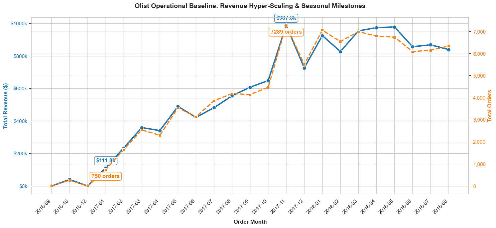
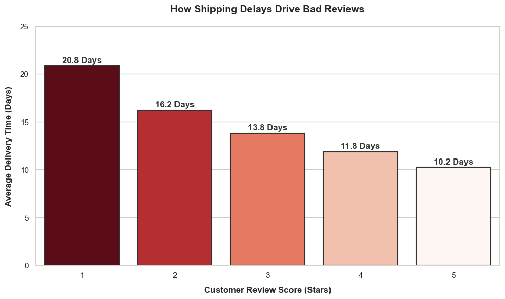
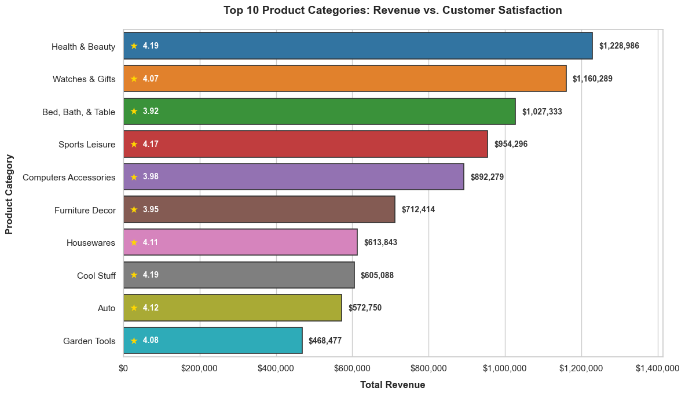

# E-Commerce Product Performance Analytics (SQL + Python)

An end-to-end analytics project exploring revenue growth, customer behavior, and operational efficiency using SQL (DuckDB) and Python (Pandas/Seaborn).

## Key Business Insights

### Growth & Seasonality

* **Hyper-Scaling Trend:** The platform experienced rapid growth throughout 2017, with gross monthly revenue increasing from $111.8k (Jan 2017) to a peak of $987.8k (Nov 2017), representing an 8.8x increase within 11 months.
* **November 2017 Volumetric Spike:** A peak of 7,289 orders generated $987.8k in revenue. This spike aligns strongly with Black Friday seasonal demand rather than steady linear growth.
* **Operational Stabilization:** In 2018, revenue stabilized within a consistent range of $830k–$970k monthly, with approximately 6,000–7,000 completed orders per month.

### Delivery Performance & Customer Satisfaction

* **10-Day Satisfaction Benchmark:** 5-star ratings correlate with an average delivery time of 10.2 days, establishing ~10 days as the operational benchmark for high customer satisfaction.
* **Impact of Delivery Delays:** As delivery time increases, satisfaction declines consistently. Beyond 13.8 days, ratings drop to 3 stars, and at approximately 20.8 days, they fall to 1 star.
* **Operational Bottleneck:** Customer dissatisfaction is strongly associated with delayed delivery times, indicating logistics performance as a key driver of customer experience.

### Product Performance

* **Revenue Leaders:** Health & Beauty and Watches & Gifts are the strongest revenue-generating categories, contributing over $2.3M in total sales with average ratings above 4.0. These categories demonstrate strong product-market fit and are suitable for further expansion.
* **Volume vs Satisfaction Risk:** Bed, Bath & Table generates $1.02M in revenue (3rd highest) and the highest order volume (9,177 orders), but records the lowest satisfaction score (3.92), indicating potential churn risk.
* **Strategic Focus Area:** Despite strong revenue contribution, Bed, Bath & Table requires further investigation into potential issues such as product quality or delivery performance, which may be driving lower customer satisfaction.

## Business Recommendations

* Improve logistics efficiency to maintain delivery times within ~10 days to sustain high customer satisfaction.
* Investigate quality and fulfillment issues in the Bed, Bath & Table category to reduce churn risk.
* Scale marketing investment in Health & Beauty and Watches & Gifts due to strong profitability and satisfaction alignment.

## Tools & Techniques

* SQL (DuckDB): multi-table joins, aggregation, and exploratory querying.
* Python (Pandas, Seaborn): data cleaning, analysis, and visualization.
* Business analytics: metric analysis, performance evaluation, and executive storytelling.

## Data Source

[Brazilian E-Commerce Public Dataset by Olist](https://www.kaggle.com/datasets/olistbr/brazilian-ecommerce)

To replicate the analysis, download the dataset and place all CSV files in the project root directory.
